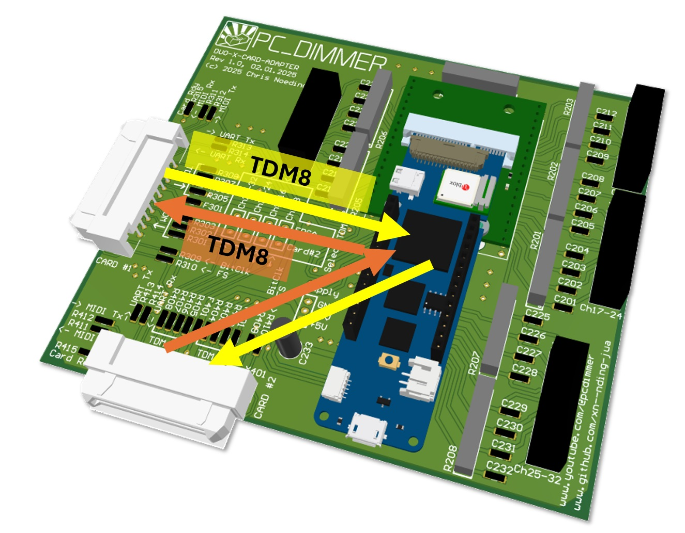
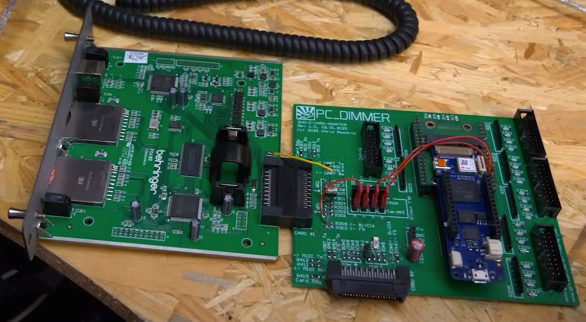
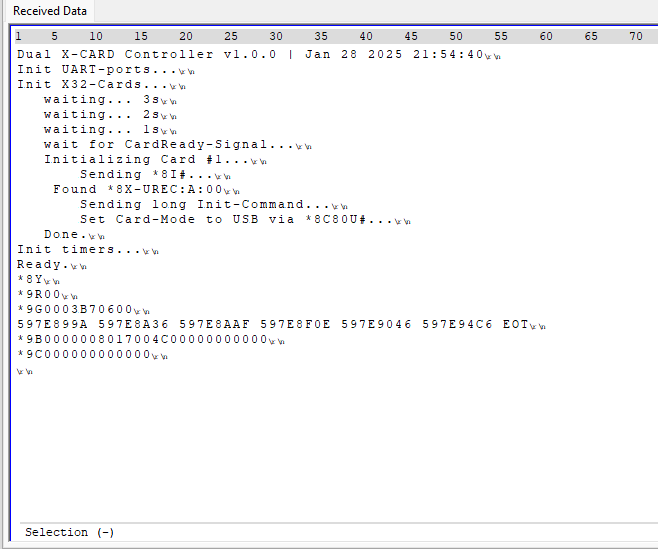
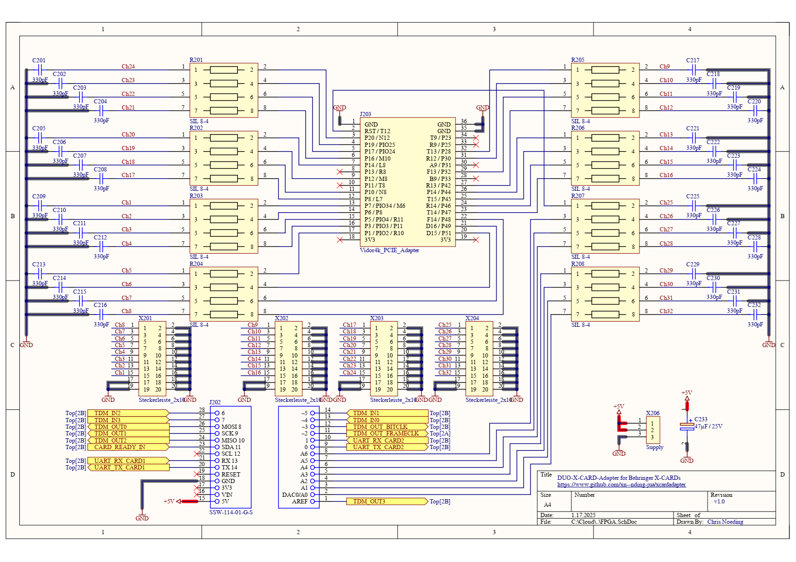

# DuoXCardAdapter
This repository contains a device to connect two Behringer X32 ExpansionCards with each other. The card uses a Arduino MKR Vidor4000 Board to route the individual TDM8-based audio-signals and initialize both cards using individual UART-connections:

## Main-Features of the system
- [x] Initializing one or two Behringer ExpansionCards
- [x] Routing individual audio-channels between both cards
- [x] Outputting up to 32 audio-signals using Sigma-Delta-Converters with RC-LowPass-filters

Using two of the original JAE-connectors it is possible to route audio-signals between two X-Cards or use the 32 RC-Filters together with some Sigma-Delta-Converters in the FPGA to create analog outputs:

The system emulates an X32 and initializes the X-Card like the real system:

Almost all available pins of the Arduino MKR Vidor4000 are used to create this beast:

## Current status of the project
The card can be used in general as shown in my Youtube-video. But the steepness of the TDM-Clock-edges from the Vidor4000 to the X-LIVE could be increased. Sometimes the XMOS-chip of the X-LIVE does not synchronize at the beginning

## More information
Have a look at the Youtube-video to see this card in action:

